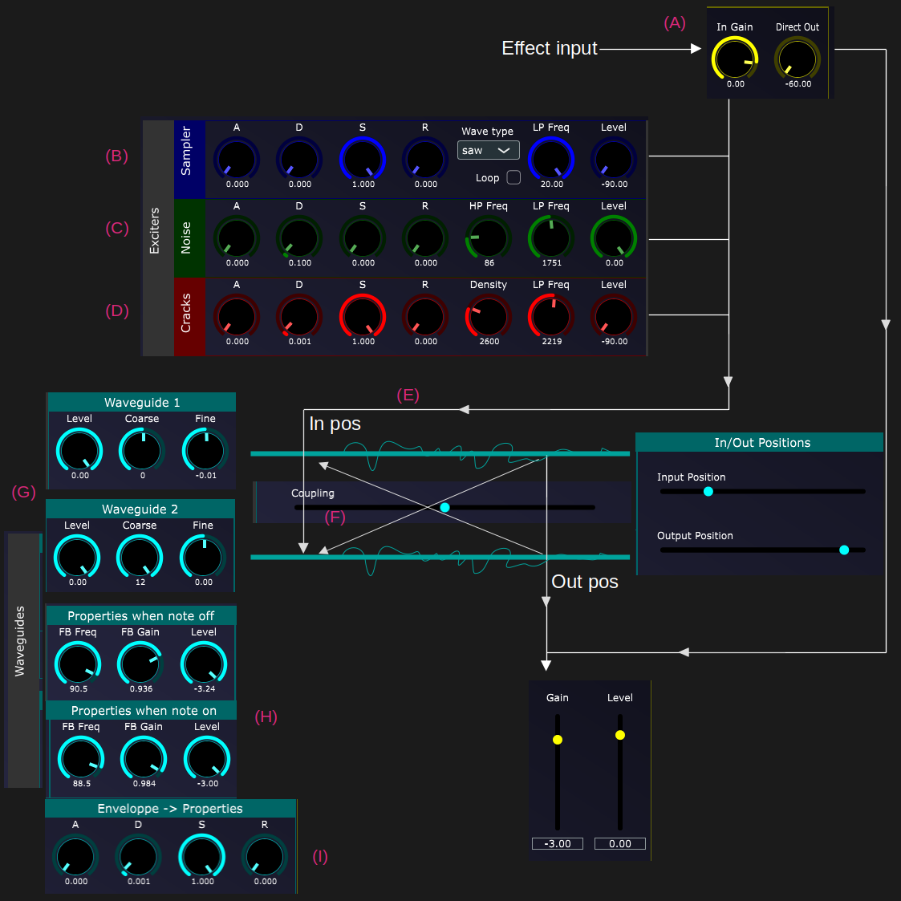

# StrinGO

_Synth based on two coupled waveguide delay lines._

## Info

StrinGO is based around two waveguides that are fed at input position by four different sources:

- The effect audio input (StrinGO is indeed seen as an audio effect with midi input)

- A basic waform oscillator

- A noise generator

- A crackling sound generator

The signal at their outpout position are then mixed together and sent to the master output section. 

The waveguides are optionnally coupled in the following way:

- Output of waveguide 1 is sent to input of waveguide 2 if _coupling_ parameter is positive.

- Output of waveguide 2 is sent to input of waveguide 1 if _coupling_ parameter is negative.

Each waveguide has individual level and pitch tunings. They share the same feedback tunings.

