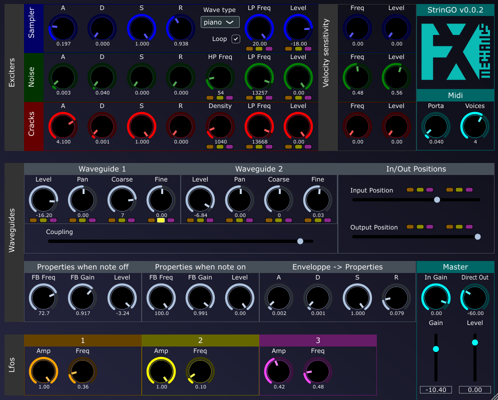

# StrinGO

_Synth based on two coupled waveguide delay lines._

## Info

StrinGO is based around two waveguides that are fed at input position by four different sources:

- The effect audio input (StrinGO is indeed seen as an audio effect with midi input) (A)

- A basic waform oscillator (B)

- A noise generator (C)

- A crackling sound generator (D)

The signal at waveguides' outpout position are then mixed together and sent to the master output section (E). 

The waveguides are optionnally coupled in the following way (F):

- Output of waveguide 1 is sent to input of waveguide 2 if _coupling_ parameter is positive.

- Output of waveguide 2 is sent to input of waveguide 1 if _coupling_ parameter is negative.

Each waveguide has individual level and pitch tunings (G).

The waveguides' feedback loop gain and lowpass filter frequency depend on the voice state (on/off) (H). Transition between states is managed by an ADSR enveloppe (I).

